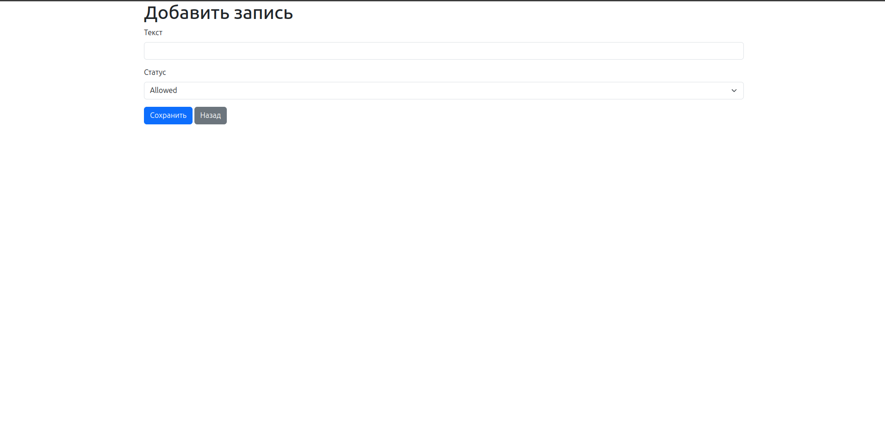

# Google-table

## Описание

Проект реализует сервис, который решает задачу синхронизации данных из БД с Google Таблицей

Сущность "Записи" имеет следующие поля:

- id
- Текст
- Статус

Сущность "Настройки" имеет следующие поля:

- id
- Ключ
- Значение

## Что было реализовано:

- **CRUD интерфейс для 1 модели**:
    - Генерирование 1000 строк
    - Очистка таблицы
    - Удаление записи
    - Создание записи
    - Добавление ссылки на google-таблицу
    - Пагинация

- **Выгрузка данных в google-таблицу**:
    - Отправка записей только со статусом allowed
    - Комментарии

- **Docker контейнеризация**:
    - Использование Docker для развертывания приложения и базы данных.

- **Шэдулер для автоматической выгрузки/обновления данных**

- **Консольная команда**
    - Получение данных из google таблицы
    - Ограничение по количеству получаемых данных

    

### Что было реализовано:

- **ClearRecordsAction** - Action для очистки записей.
- **CreateRecordAction** — Action для создания записи в бд.
- **DeleteRecordAction** — Action для удаления записи.
- **FetchGoogleSheetCommentsAction** - Action для получения комментариев из Google таблицы.
- **GenerateRecordsAction** - Action для генерации записей.
- **SetGoogleSheetUrlAction** — Action для сохранения или обновления URL Google таблицы.
- **SyncGoogleSheetAction** — Action для синхронизации данных с Google таблицей.
- **UpdateRecordAction** — Action для обновления записи.
- **FetchGoogleSheetComments** — Команда для получения и вывода комментариев из Google таблицы в терминал.
- **SyncGoogleSheet** — Команда для синхронизации данных с Google таблицей.
- **GoogleSheetCommentDto** - Данные о комментариях.
- **GoogleSheetSyncDto** - Данные для синхронизации вашей базы данных с Google таблицей.
- **GoogleSheetUrlDto** - Данные об url.
- **RecordDto** - Запись.
- **RecordController** - Контроллер для обработки запросов записей.
- **SetGoogleSheetUrlRequest** - Валидация url.
- **StoreRecordRequest** - Валидация новой записи.
- **UpdateRecordRequest** - Валидация обновления записи.
- **Record** - Модель для работы с данными записи.
- **Setting** - Модель для работы с url.
- **2025_07_23_190926_create_records_table** - Миграция для создания таблицы записей.
- **2025_07_23_191901_create_settings_table** - Миграция для создания таблицы настроек (url).
- **app.blade.php** - Базовая форма для всех страниц.
- **create.blade.php** - Форма создания записи.
- **edit.blade.php** - Форма редактирования записи.
- **index.blade.php** - Список всех записей и основные действия.
- **web** - роуты.
- **Dockerfile** — Конфигурация для создания контейнера Docker.
- **docker-compose.yml** — Настройки для запуска контейнеров с помощью Docker Compose.
- **.env** — Файл с переменными окружения для настройки конфигураций.
- **README.md** — Описание проекта, инструкция по установке и запуску.

## Инструкция по запуску

1. Клонирование репозитория
git clone git@github.com:cH1NESY/google-table.git
cd google-table

2. Запуск контейнеров
docker-compose up -d --build

3. Установите связь с бд
Database->"+"->Data Source->MySQL.
ввод пользователя, пароля, порта и названия бд:
DB_PORT=3307
DB_DATABASE=laravel
DB_USERNAME=user
DB_PASSWORD=pass
Test connection->Apply->Ok

4. Выполнение миграции
Вводим в терминал:
docker exec -it php-fpm-google bash
в контейнере запускаем миграцию:
php artisan migrate

5. Открываем страницу
В браузере переходим по адресу http://localhost:94/records

6. Запуск команд вручную
Выгрузка в google-таблицу:
В контейнере запускаем:
php artisan app:sync-google-sheet

Вытянуть из google-таблицы:
В контейнере запускаем:
php artisan app:sync-google-sheet

## Страница приложения

## Добавление записи

## Google-таблица

# Google-table
